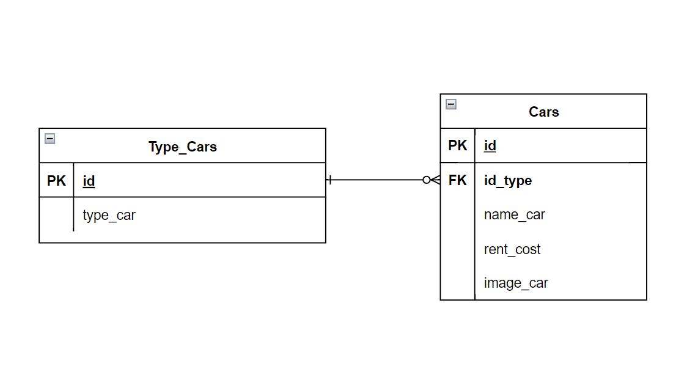

# Car Management Dashboard

## Entity Relationship Diagrams


## Link Pages
- index:
http://localhost:3000
- create car: http://localhost:3000/create-car
- edit car page: http://localhost:3000/edit-car/:id
- filter: http://localhost:3000/id
- search: http://localhost:3000/search

## Endpoint REST API
- create car => post: http://localhost:3000/api/v1/Cars
- read car => get: http://localhost:3000/api/v1/Cars/:id
- update car => post: http://localhost:3000/api/v1/Cars/:id
- delete car => get: http://localhost:3000/api/v1/deleteCars/:id
- filter car => get: http://localhost:3000/api/v1/Filtercars/:id
- search car => get: http://localhost:3000/api/v1/SearchCars/:search

## Example req body
- car dengan id:
get => http://localhost:3000/api/v1/Cars/:4 
output: 
```typescript
{
    "id": 4,
    "name_car": "ferrari",
    "rent_cost": 100000,
    "image_car": "image_car-1681523074547.png",
    "id_type": 2,
    "createdAt": "2023-04-15T01:44:34.551Z",
    "updatedAt": "2023-04-15T01:44:34.551Z",
    "type_car": null
}
```


